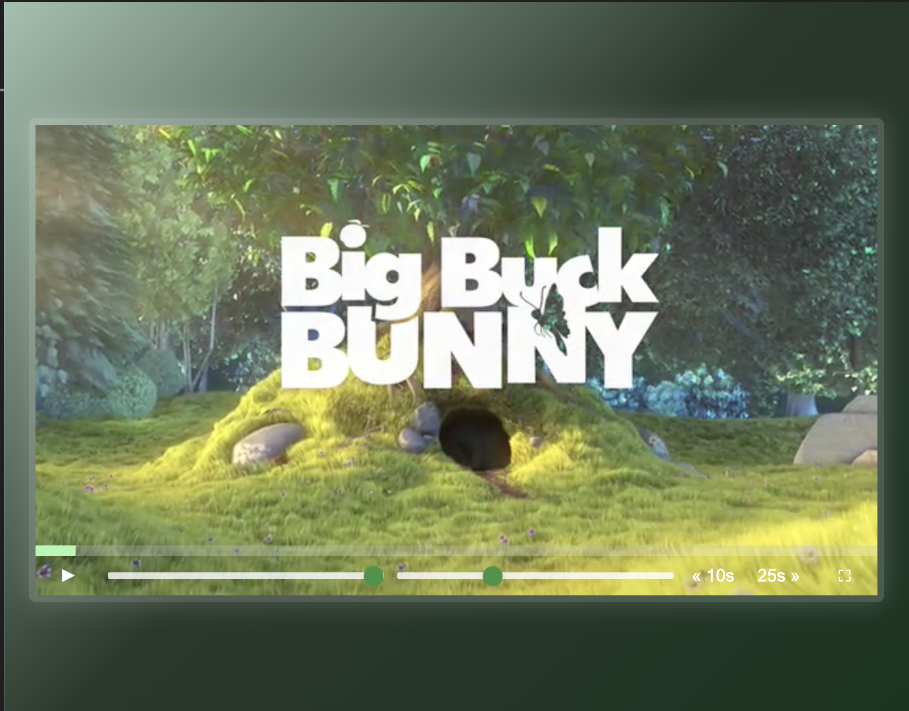

# HTML5 Custom Video Player



A functional custom video player built using HTML5, CSS, and JavaScript. This project provides complete control over video playback, volume, and speed, with a user-friendly UI and interactive controls. It enhances the native video experience with custom styling and added functionality like **skip buttons, progress tracking, and fullscreen mode**.

## Key Features
- **Custom Play/Pause Toggle**: Click the video or button to play/pause.
- **Volume & Playback Speed Control**: Adjust volume and speed using sliders.
- **Progress Bar**: See the playback progress and seek anywhere in the video.
- **Skip Buttons**: Jump **backward (⏪ 10s)** or **forward (⏩ 25s)** with a click.
- **Fullscreen Mode**: Toggle fullscreen for an immersive experience.
- **Modern UI**: A sleek and responsive design with animated controls.

## Technologies Used
- **Frontend**: HTML, CSS (custom styling, gradients, and responsive UI).
- **JavaScript**: Handles all video playback controls, progress tracking, and event listeners.

## How to Run
1. Clone the repository:
   ```bash
   git clone https://github.com/yourusername/Custom-Video-Player.git
   cd Custom-Video-Player
   ```
2. Open `index.html` in your browser to use the custom video player.

## Live Demo
Check out the live demo here: [Live Demo Link](#) (Replace `#` with your deployed URL)

## Contributions
- Feel free to **open issues** for bugs or feature suggestions.
- **Pull requests** are welcome for enhancements or new features.
- This project is **open-sourced**, and I appreciate **constructive feedback** and **collaborations**!

## Future Enhancements
- Add **theater mode** with a dark background.
- Implement **custom subtitles** support.
- Add **picture-in-picture mode** for multitasking.
- Include **keyboard shortcuts** for faster controls.

Thank you for exploring this project! ❤️